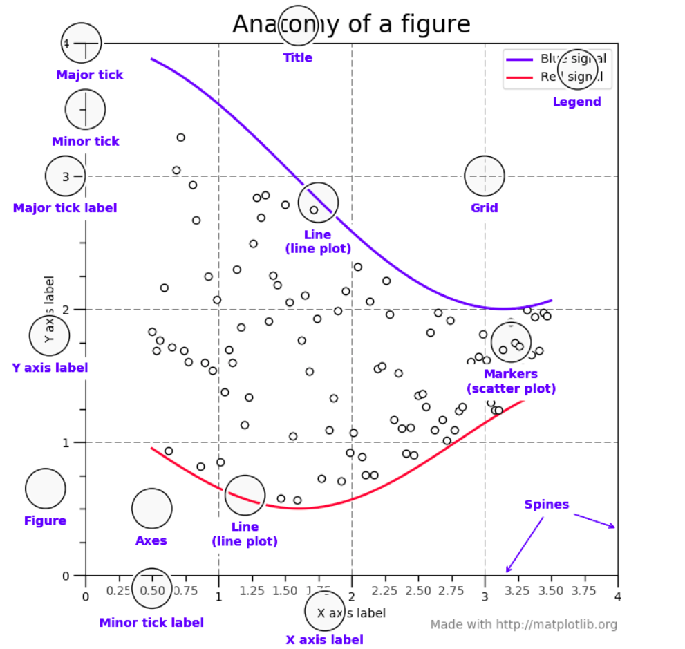
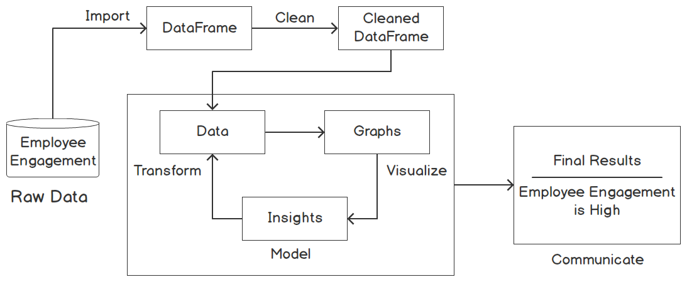
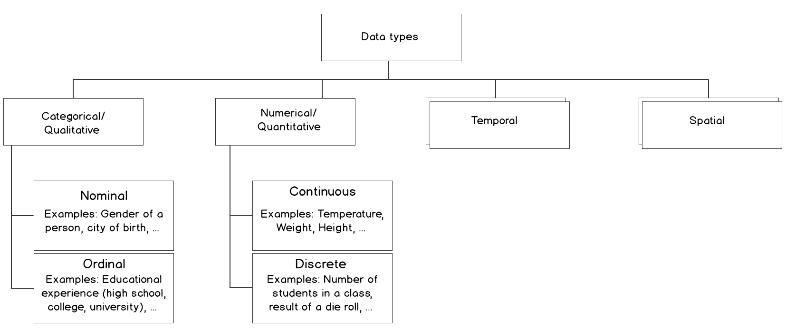

# Matploylib examples
[](https://github.com/SalAlba/matplotlib/blob/master/LICENSE)

In this github repo, I use python 3.7.* and matplotlib 3.1.3 to generate different type of data visualization, feel free to ask me, add new issue and fork 😀.

## Authors

* **Salem Albarudy** - [Website](salem-albarudy.com) | [GitHub](https://github.com/salalba) | [Linkedin](https://linkedin.com/in/salem-albarudy/)

See also the list of [contributors](https://github.com/your/project/contributors) who participated in this project.

## Getting Started

These instructions will get you a copy of the project up and running on your local machine for development and testing purposes.

### Prerequisites

+ Python >= 3.7.
+ pip3

### Installing

A step by step series of examples that tell you how to get a development env running

1. clone the repo to your local machine using

``` repo
    $ git clone https://github.com/SalAlba/matplotlib.git
    $ cd matplotlib
```

2. create virtual env and run using

``` bash
    $ virtualenv  venv
    $ source venv/bin/activate
```

3. install all requirements using

``` bash
    $ pip install -r requirements.txt
```


## Notes / Things you should to know

<figure>
  <figcaption>(Fig. 1.) Parts of a Figure <a href="#Resources">[2.5.]</a></figcaption>
  
</figure>


**Data wrangling** is the process of transforming raw data into a suitable representation for various tasks. It is the discipline of augmenting, cleaning, filtering, standardizing, and enriching data in a way that allows it to be used in a downstream task, which in our case is data visualization.[[2.6]](#Resources)
<figure>
  <figcaption>(Fig. 2.) Data wrangling process to measure employee engagement <a href="#Resources">[2.6.]</a></figcaption>
  
</figure>

### Types of Data


| Data type | Best suited measures of central tendency for different types of data |
|-----------|----------------------------------------------------------------------|
| Nominal   | Mode                                                                 |
| Ordinal   | Median                                                               |
| Numerical | Mode/Median                                                          |

<figure>
  <figcaption>(Fig. 3.) Classification of types of data <a href="#Resources">[2.6.]</a></figcaption>
  
</figure>

### What Makes a Good Visualization?
**There are multiple aspects to what makes a good visualization:**
* Most importantly, the visualization should be self-explanatory and visually appealing. To make it self-explanatory, use a legend, descriptive labels for your x-axis and y-axis, and titles.
* A visualization should tell a story and be designed for your audience. Before creating your visualization, think about your target audience; create simple visualizations for a non-specialist audience and more technical detailed visualizations for a specialist audience. Think about a story to tell with your visualization so that your visualization leaves an impression on the audience.

**Common Design Practices**
* Use colors to differentiate variables/subjects rather than symbols, as colors are more perceptible.
* To show additional variables on a 2D plot, use color, shape, and size.
* Keep it simple and don't overload the visualization with too much information.

### Different Plots


```
Distribution plots give a deep insight into how your data is distributed. For a single variable, a histogram is effective. For multiple variables, you can either use a box plot or a violin plot. The violin plot visualizes the densities of your variables, whereas the box plot just visualizes the median, the interquartile range, and the range for each variable.
```

```
Geological plots are a great way to visualize geospatial data. Choropleth maps can be used to compare quantitative values for different countries, states, and so on. If you want to show connections between different locations, connection maps are the way to go.
```


#### Scatter Plot (Relation plots)

TODO ... What/Use/Dont's/Design Practices/ ex. plot

#### Correlogram  (Relation plots)

TODO ... What/Use/Dont's/Design Practices/ ex. plot

#### Heatmap (Relation plots)

TODO ... What/Use/Dont's/Design Practices/ ex. plot


#### Line Chart

TODO ... What/Use/Dont's/Design Practices/ ex. plot


#### Bar Chart

TODO ... What/Use/Dont's/Design Practices/ ex. plot


**Don'ts of Bar Charts**

+ Don't confuse vertical bar charts with histograms. Bar charts compare different variables or categories, while histograms show the distribution for a single variable.

+ Another common mistake is to use bar charts to show central tendencies among groups or categories. Use box plots or violin plots to show statistical measures or distributions in these cases.


#### Radar Chart

TODO ... What/Use/Dont's/Design Practices/ ex. plot


#### Pie Chart (Composition Plots)

TODO ... What/Use/Dont's/Design Practices/ ex. plot

**Design Practices**
  * Arrange the slices according to their size in increasing/decreasing order, either in a clockwise or counterclockwise manner.
  * Make sure that every slice has a different color.

#### Variants: Donut Chart (Composition Plots)

TODO ... What/Use/Dont's/Design Practices/ ex. plot

**Design Practice**
  * Use the same color that's used for the category for the subcategories. Use varying brightness levels for the different subcategories.

#### Stacked Bar Chart (Composition Plots)

TODO ... What/Use/Dont's/Design Practices/ ex. plot


**Design Practices**
  * Use contrasting colors for stacked bars.
  * Ensure that the bars are adequately spaced to eliminate visual clutter. The ideal space guideline between each bar is half the width of a bar.
  * Categorize data alphabetically, sequentially, or by value, to uniformly order it and make things easier for your audience.

#### Stacked Area Chart (Composition Plots)

TODO ... What/Use/Dont's/Design Practices/ ex. plot


**Design Practice**
  * Use transparent colors to improve information visibility. This will help you to analyze the overlapping data and you will also be able to see the grid lines.


#### Venn Diagram/set diagrams (Composition Plots)

TODO ... What/Use/Dont's/Design Practices/ ex. plot

**Design Practice**
  * It is not recommended to use Venn diagrams if you have more than three groups. It would become difficult to understand. *(I'm Not Sure :P)*


#### Histogram (Distribution plots)

TODO ... What/Use/Dont's/Design Practices/ ex. plot

**Design Practice**
  * Try different numbers of bins (data intervals), since the shape of the histogram can vary significantly.


#### Density Plot (Distribution plots)

TODO ... What/Use/Dont's/Design Practices/ ex. plot

**Design Practice**
  * Use contrasting colors to plot the density of multiple variables.


#### Violin (Distribution plots)

TODO ... What/Use/Dont's/Design Practices/ ex. plot

**Design Practice**
  * Scale the axes accordingly so that the distribution is clearly visible and not flat.


#### Dot Map (Geological plots)

TODO ... What/Use/Dont's/Design Practices/ ex. plot

**Design Practices**
  * Do not show too many locations. You should still be able to see the map to get a feel for the actual location.
  * Choose a dot size and value so that in dense areas, the dots start to blend. The dot map should give a good impression of the underlying spatial distribution.


#### Choropleth Map (Geological plots)

TODO ... What/Use/Dont's/Design Practices/ ex. plot

**Design Practices**
  * Use darker colors for higher values, as they are perceived as being higher in magnitude.
  * Limit the color gradation, since the human eye is limited in how many colors it can easily distinguish between. Seven color gradations should be enough.


#### Connection Map (Geological plots)

TODO ... What/Use/Dont's/Design Practices/ ex. plot


**Design Practices**
  * Do not show too many connections as it will be difficult for you to analyze the data. You should still see the map to get a feel for the actual locations of the start and end points.
  * Choose a line thickness and value so that the lines start to blend in dense areas. The connection map should give a good impression of the underlying spatial distribution.


## Contributing

Please read [CONTRIBUTING.md](https://gist.github.com/PurpleBooth/b24679402957c63ec426) for details on our code of conduct, and the process for submitting pull requests to us.


## License
[](https://github.com/SalAlba/matplotlib/blob/master/LICENSE)

This project is licensed under the MIT License - see the [LICENSE.md](LICENSE.md) file for details, Copyright 2020 © <a href="https://github.com/SalAlba/" target="_blank">Salem Albarudy</a>.


## Acknowledgments

* Hat tip to anyone whose code was used
* Inspiration
* etc


## Recommendations / How to learn

At this moments no need to buy books or courses to learn matplotlib, enough to visit the official website of matplotlib and make the whole tutorial and that's it 😀 if you want more you can learn from me repo !!!

1. [Python Data Science Handbook 🔥🔥🔥 ](https://jakevdp.github.io/PythonDataScienceHandbook/)
2. [PacktWorkshops/The-Data-Visualization-Workshop](https://github.com/PacktWorkshops/The-Data-Visualization-Workshop)

## Resources

#### 1. Books
+ [[1.1.] Python Data Science Handbook ](https://github.com/jakevdp/PythonDataScienceHandbook/blob/master/notebooks/04.00-Introduction-To-Matplotlib.ipynb)

#### 2. Websites
+ [[2.1.] Matplotlib Official documentation ](https://matplotlib.org/tutorials/index.html)

+ [[2.2.] github readme template 1 ](https://gist.github.com/PurpleBooth/109311bb0361f32d87a2)
+ [[2.3.] github readme template 2 ](https://gist.github.com/fvcproductions/1bfc2d4aecb01a834b46)
+ [[2.4.] Badger | shields.io ](https://shields.io/)
+ [[2.5.] Matplotlib Usage Guide](https://matplotlib.org/tutorials/introductory/usage.html#sphx-glr-tutorials-introductory-usage-py)
+ [[2.6.] PacktWorkshops/The-Data-Visualization-Workshop](https://github.com/PacktWorkshops/The-Data-Visualization-Workshop)

#### 3. Youtube
+ [[3.0.] Owner of the chanel | Chanel name | Tutorial name ](#)
+ [[3.1.] Giles McMullen-Klein | Python Programmer | Watch this if you want to LEARN MATPLOTLIB for PYTHON!](https://www.youtube.com/watch?v=6rKe2IEIu8c)

#### 4. Papers

