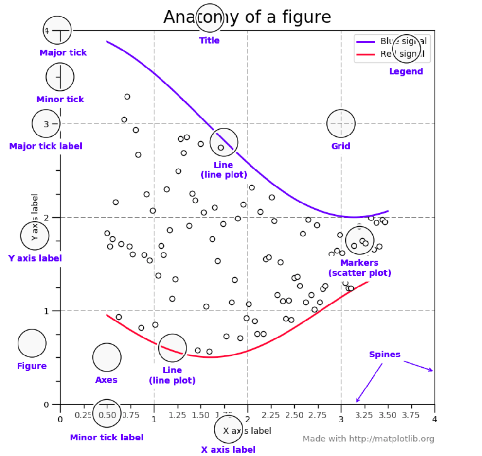

# Matploylib examples
[](https://github.com/SalAlba/matplotlib/blob/master/LICENSE)

In this github repo, I use python 3.7.* and matplotlib 3.1.3 to generate different type of data visualization, feel free to ask me, add new issue and fork 😀.

## Authors

* **Salem Albarudy** - [Website](salem-albarudy.com) | [GitHub](https://github.com/salalba) | [Linkedin](https://linkedin.com/in/salem-albarudy/)

See also the list of [contributors](https://github.com/your/project/contributors) who participated in this project.

## Getting Started

These instructions will get you a copy of the project up and running on your local machine for development and testing purposes.

### Prerequisites

+ Python >= 3.7.
+ pip3

### Installing

A step by step series of examples that tell you how to get a development env running

1. clone the repo to your local machine using

``` repo
    $ git clone https://github.com/SalAlba/matplotlib.git
    $ cd matplotlib
```

2. create virtual env and run using

``` bash
    $ virtualenv  venv
    $ source venv/bin/activate
```

3. install all requirements using

``` bash
    $ pip install -r requirements.txt
```

## Documentation

```
# TODO ...

```

## Notes / Things you should to know

<figure>
  <figcaption>Parts of a Figure <a href="#Resources">[2.5.]</a></figcaption>
  
</figure>


## Contributing

Please read [CONTRIBUTING.md](https://gist.github.com/PurpleBooth/b24679402957c63ec426) for details on our code of conduct, and the process for submitting pull requests to us.


## License
[](https://github.com/SalAlba/matplotlib/blob/master/LICENSE)

This project is licensed under the MIT License - see the [LICENSE.md](LICENSE.md) file for details, Copyright 2020 © <a href="https://github.com/SalAlba/" target="_blank">Salem Albarudy</a>.


## Acknowledgments

* Hat tip to anyone whose code was used
* Inspiration
* etc


## Recommendations / How to learn

At this moments no need to buy books, courses to learn matplotlib, enough to visit the official website of matplotlib and make the whole tutorial and that's it 😀 if you want more you can learn from me repo !!!

## Resources

#### 1. Books
+ [[1.1.] Python Data Science Handbook ](https://github.com/jakevdp/PythonDataScienceHandbook/blob/master/notebooks/04.00-Introduction-To-Matplotlib.ipynb)

#### 2. Websites
+ [[2.1.] Matplotlib Official documentation ](https://matplotlib.org/tutorials/index.html)

+ [[2.2.] github readme template 1 ](https://gist.github.com/PurpleBooth/109311bb0361f32d87a2)
+ [[2.3.] github readme template 2 ](https://gist.github.com/fvcproductions/1bfc2d4aecb01a834b46)
+ [[2.4.] Badger | shields.io ](https://shields.io/)
+ [[2.5.] Matplotlib Usage Guide](https://matplotlib.org/tutorials/introductory/usage.html#sphx-glr-tutorials-introductory-usage-py)
#### 3. Youtube
+ [[3.0.] Owner of the chanel | Chanel name | Tutorial name ](#)
+ [[3.1.] Giles McMullen-Klein | Python Programmer](https://www.youtube.com/watch?v=6rKe2IEIu8c)

#### 4. Papers

