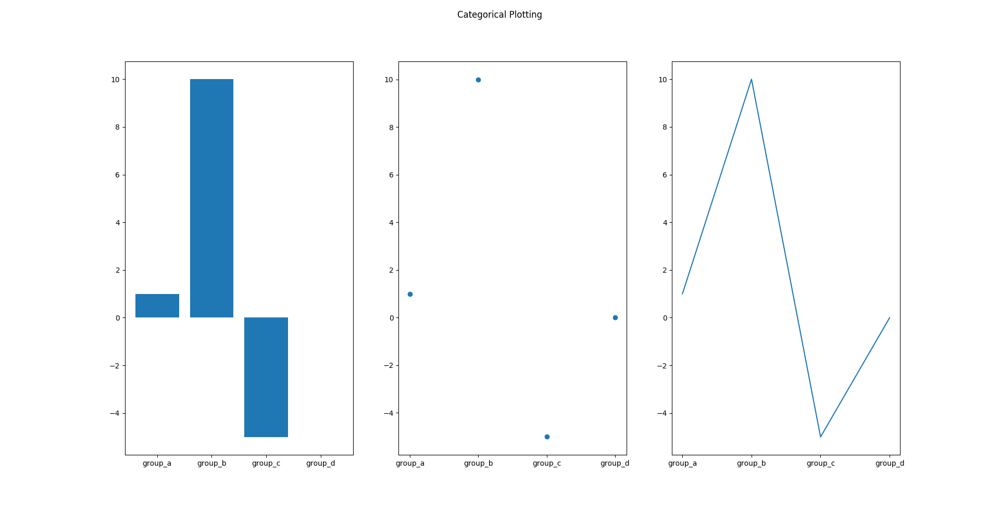

# Jupyter Notebook


## Basic steps

### start
every script matplotlib should import the library like below

``` python

import matplotlib.pyplot as plt
import numpy as np

```

#### Draw first line [[2.1.]](#2.Websites)

To draw a simple plot in matplotlib you can use just two line of code as shown below, Fig. 1 show the output of the code

``` python
# check ex1.py

plt.plot([25, 28, 30, 44])
plt.show()
```

As we see in the fig. 1. the Xaxis start from zero and the Yaxis start from 25, as we see in previous code we pass to ``plt.plot()`` a just one list `[25, 28, 30, 44]` so by default matplotlib will assumes it's value of y.


#### Formatting the style of your plot [[2.2.]](#2.Websites)

``` python
# check ex2.py

plt.plot([1, 2, 3, 4], [1, 4, 9, 16], 'ro')
plt.axis([0, 6, 0, 20])
plt.show()
```


#### Plotting with keyword strings [[2.1.]](#2.Websites)

we can use simply matplotlib with pandas as we see below

``` python
# check ex3.py

# ....
data = {
    'a': np.arange(50),
    'c': np.random.randint(0, 50, 50),
    'd': np.random.randn(50)
    }
data['b'] = data['a'] + 10 * np.random.randn(50)
data['d'] = np.abs(data['d']) * 100

# ...
plt.scatter('a', 'b', c='c', s='d', data=data)
plt.xlabel('entry a')
plt.ylabel('entry b')
plt.show()
```


#### Plotting with categorical variables [[2.1.]](#2.Websites)

matplotlib give user ability to plot using categorical data.

``` python
# check ex4.py

# ...
names = ['group_a', 'group_b', 'group_c', 'group_d']
values = [1., 10., -5., 0.]

# ...
plt.figure(figsize=(9, 3))

plt.subplot(131)
plt.bar(names, values)
plt.subplot(132)
plt.scatter(names, values)
plt.subplot(133)
plt.plot(names, values)
plt.suptitle('Categorical Plotting')
plt.show()

```



#### Working with multiple figures and axes

```plt.subplot(nrows, ncols, index)```
+ nrows : number of rows.
+ ncols : number of cols.
+ index : where to set the fig. ranges from 1 to numrows*numcols.

_:warning: Note The commas in the subplot command are optional plt.subplot(2,4,1) are the same like plt.subplot(241)_

``` python
# check ex5.py

plt.subplot(1,2,1)
plt.title('121')
plt.subplot(1,2,2)
plt.title('122')
plt.show()

```


#### Working with text [[2.3.]](#2.Websites) [[2.4.]](#2.Websites)

``` python
# ex6.

plt.text(1, -1.5, r'$\mu=100,\ \sigma=15$')

```

## Resources


+ [[2.1.] Pyplot tutorial](https://matplotlib.org/tutorials/introductory/pyplot.html#sphx-glr-tutorials-introductory-pyplot-py)

+ [[2.2.] Formatting the style of your plot](https://matplotlib.org/api/_as_gen/matplotlib.pyplot.plot.html#matplotlib.pyplot.plot)

+ [[2.3.] Text properties and layout](https://matplotlib.org/tutorials/text/text_props.html)

+ [[2.4.] Writing mathematical expressions](https://matplotlib.org/tutorials/text/mathtext.html)


